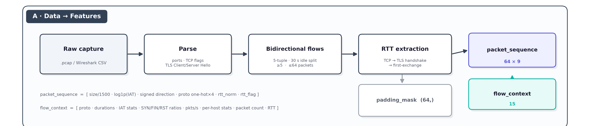
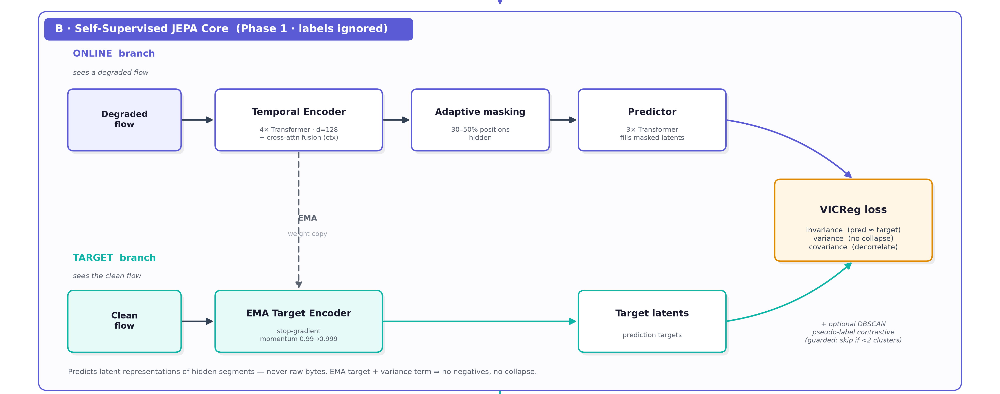
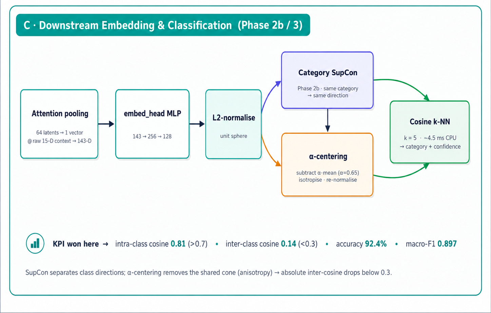
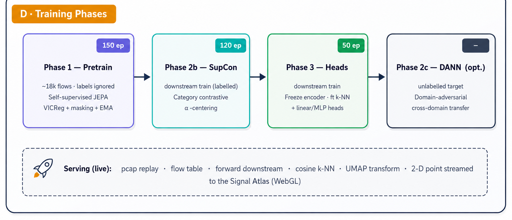

# 2 · Architecture

A high-level overview. For ASCII block diagrams and every module, see [`../doc.md`](../doc.md).

---

## 2.1 Data → Features



Raw network captures (`.pcap` or Wireshark CSV) flow through four stages before the
model sees any data:

1. **Parse** — extract ports, TCP flags (SYN/ACK/FIN/RST), and TLS Client/Server Hello markers.
2. **Bidirectional flow grouping** — canonical 5-tuple key; 30 s idle split; flows kept at ≥ 5 and ≤ 64 packets. The client/device is the SYN initiator, else the **private/local endpoint**, else the first packet's source (so direction is correct on real mid-stream captures).
3. **RTT extraction** — TCP handshake → TLS handshake → first-exchange fallback.
4. **Per-capture host stats** — `n_dst_ips / n_dst_ports / n_src_ports / conn_per_sec` are computed **per capture** (per `source_file` at train time, per uploaded pcap at inference). This keeps the host-behaviour features both discriminative and identical between training and serving — the fix that took accuracy 0.86 → 0.997 (see [results.md §5.3](results.md)).
5. **Feature tensors**
   - `packet_sequence` **(64 × 9)**: `[size/1500, log1p(IAT), signed direction, proto one-hot×4, rtt_norm, rtt_flag]`
   - `flow_context` **(15,)**: proto, durations, IAT stats, SYN/FIN/RST ratios, pkts/s, per-capture host stats, packet count, RTT
   - `padding_mask` **(64,)**: real packet vs. zero-padding

The exact same parse→flow→features code runs on Kaggle CSVs, converted VLC/CG captures, and
uploaded `.pcap`s. `min_packets`, `max_packets`, `flow_timeout` are config-driven
(`src/netjepa/configs/default.yaml`; the 8-class build uses `traffic.yaml`).

---

## 2.2 The Model — a JEPA



Net-JEPA does not reconstruct raw bytes. It predicts *latent representations* of hidden
flow segments — the JEPA approach — which is what allows it to learn structure without labels.

- **Online branch** (sees a *degraded* copy of the flow): Temporal Transformer encoder
  (4 layers, d=128) → cross-attention fusion with the flow-context vector → adaptive
  masking (30–50 % of positions hidden) → a 3-layer predictor fills in the masked latents.
- **Target branch** (sees the *clean* flow): an **EMA copy** of the encoder
  (momentum 0.99→0.999, stop-gradient) produces the prediction targets. This is the
  anti-collapse mechanism — no negative pairs needed.
- **Loss:** **VICReg** = invariance (predicted ≈ target) + variance (don't collapse) +
  covariance (don't correlate dimensions). An optional DBSCAN pseudo-label contrastive
  term adds coarse class structure, guarded to skip when it finds < 2 clusters.

---

## 2.3 The Embedding — Where the KPIs Are Determined



The downstream embedding is the component the cosine KPI measures, so it receives particular care:

1. **Attention pooling** collapses the 64 packet latents into one flow vector, concatenated
   with the raw 15-D context → 143-D.
2. **`embed_head`** MLP (143→256→128) → **L2-normalise** → a point on the unit sphere.
3. **Category SupCon** (Phase 2b) trains this embedding so same-*type* flows point
   together. Supervised at the **traffic-type** level (one of 8 types — "YouTube and Netflix"
   are both `video_on_demand`).
4. **α-centering** (`set_centering`, α≈0.65): SupCon separates class *directions* but leaves
   them in a shared cone (high absolute cosine). Subtracting α·mean and re-normalising
   isotropises the space, dropping inter-class cosine to ≈ −0.04 while intra stays ≈ 0.98.

Classification is a **cosine k-NN (k=5)** over the labelled embeddings — ~3.5 ms on CPU.

---

## 2.4 Training Phases



| Phase | Data | What it does |
|---|---|---|
| **1 — Pretrain** (150 ep) | ~20k flows (full 70% train), **labels ignored** | Self-supervised JEPA (VICReg + masking + EMA) |
| **2b — SupCon** (120 ep) | full training set (labelled, 8 types) — the same 70% as pretrain | Traffic-type contrastive on the kept embedding + α-centering. Init from Phase 1. |
| **3 — Heads** (50 ep) | full training set (== pretrain) | Freeze encoder; fit k-NN + class-weighted linear/MLP heads; save `knn.joblib` |
| *2c — DANN* (optional) | + unlabelled target | Domain-adversarial adaptation for cross-domain transfer |

(Phase 2 — an unsupervised contrastive refinement — is retained but skipped in the
recommended path; it didn't help separation.)

---

## 2.5 The Live System

```
  .pcap upload ─► src/server/app.py (FastAPI)
                    pcap_to_flows (scapy → flow_builder.extract_flows, same as training)
                    → compute_src_host_stats over THIS pcap (per-capture)
                    → NetJEPAClassifier.predict_flow → forward_downstream
                    → cosine k-NN → traffic type + confidence
                    → UMAP.transform → 2-D point appended to the growing cloud
                  every stage streamed over /ws  ──►  webui animates it live
  GET /api/cloud   reference cloud + everything inferred so far
  GET /api/metrics KPIs / per-class stats
```

The terminal tool `infer_pcap.py` uses the identical path and additionally prints
flow-count / packet-weighted / confidence-filtered summaries and the **dominant traffic
type by packets**.

The web UI ("Signal Atlas") reads a static export when the server is down and the live
server when it's up — see [features.md](features.md) and [usage.md](usage.md).

---

## 2.6 Repository Layout

```
src/                all Python source (installable via `pip install -e .`)
  netjepa/          core ML package (data, model, loss, training, downstream, evaluation, scripts)
  capture/          live packet capture (pcap replay)
  flows/            flow grouping for the live server
  model/            server-facing classifier adapter
  server/           FastAPI + WebSocket backend
webui/              "Signal Atlas" React/WebGL front-end (its own webui/src/)
pyproject.toml / setup.py   packaging for the src/ layout
docs/               this documentation
doc.md              deep engineering reference
experimentation_log.md  honest chronological research log
```
